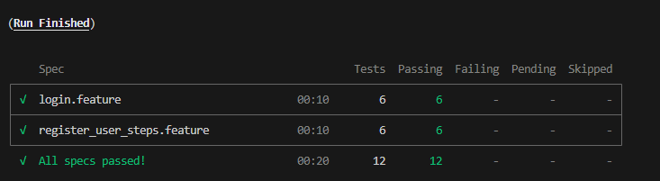

# 🧪 Projeto de Testes Automatizados com Cypress

Este projeto foi desenvolvido como prática de **automação de testes end-to-end (E2E)** utilizando o **Cypress**, aplicando os conceitos de **BDD (Behavior Driven Development)** com **Gherkin**.  
Os testes cobrem cenários de **Login** e **Registro de Usuário** no site [Automation Pratice](https://automationpratice.com.br/my-account).

---

## 🚀 Tecnologias Utilizadas

- **Cypress**
- **Node.js**
- **Cucumber (BDD)** — via `@badeball/cypress-cucumber-preprocessor`
- **Faker.js** — para geração dinâmica de dados
- **JavaScript (ES6)**

---

## ⚙️ Configuração do Projeto

### 📁 Estrutura de Pastas

```

📦 cypress/
┣ 📂 e2e/
┃ ┗ 📂 features/               # Cenários escritos em Gherkin (.feature)
┃     ┣ 📜 login.feature
┃     ┗ 📜 register_user_steps.feature
┣ 📂 support/
┃ ┣ 📂 step_definitions/       # Implementações dos steps do Gherkin (BDD)
┃ ┃ ┣ 📜 login_steps.js
┃ ┃ ┗ 📜 register_user_steps.js
┃ ┣ 📂 pages/                  # Page Objects com funções de navegação e ações
┃ ┃ ┣ 📜 home_page.js
┃ ┃ ┣ 📜 login_page.js
┃ ┃ ┗ 📜 register_page.js
┃ ┗ 📂 elements/               # Mapeamento de seletores e dados do Faker
┃   ┗ 📜 dataUser.js
┗ 📜 cypress.config.js         # Configuração geral do Cypress

````

---

### 🌐 Configuração no `cypress.config.js`

```js
const { defineConfig } = require("cypress");

module.exports = defineConfig({
  e2e: {
    baseUrl: "https://automationpratice.com.br",
    defaultCommandTimeout: 5000,
    specPattern: "cypress/e2e/features/*.feature",
  },
});
````

---

## 🧩 Estrutura de Suporte

### `dataUser.js`

Arquivo que utiliza `fakerPT_BR` para gerar dados dinâmicos de teste:

```js
import { fakerPT_BR } from '@faker-js/faker';

export const data = {

    fields:{
        nameField: "#user",
        passWField: '#password',
        emailField: '#email'
    },

    info: {
        name: fakerPT_BR.person.fullName(),
        email: fakerPT_BR.internet.email(),
        pass: fakerPT_BR.internet.password(8),
        invalidData: fakerPT_BR.string.alpha(5)
    }
}

```

---

## 🧱 Page Objects

Os arquivos em `support/pages` encapsulam as ações realizadas nas páginas, tornando os testes mais organizados e fáceis de manter.

---

## 🧪 Cenários de Teste

### 🔐 Login (`login.feature`)

Cenários implementados:

* Login com campos em branco
* E-mail em branco
* E-mail inválido
* Senha em branco
* Senha inválida
* Login bem-sucedido

---

### 🧍 Registro (`register_user_steps.feature`)

Cenários implementados:

* Registro com campos em branco
* Nome vazio
* E-mail vazio
* E-mail inválido
* Senha vazia
* Senha incorreta
* Registro bem-sucedido

---

## ▶️ Como Executar o Projeto

### 1️⃣ Instalar Dependências

```bash
npm install
```

### 2️⃣ Executar o Cypress em modo interativo

```bash
npx cypress open
```

### 3️⃣ Executar em modo headless

```bash
npx cypress run
```

---

## 📸 Exemplo de Execução



---

## ✍️ Autor

**Luis Fernando Afonso**
💼 Projeto desenvolvido para estudo de automação com Cypress
📧 Contato: [luis.sun@gmail.com](mailto:luis.sun@gmail.com)

---

## 🧾 Licença

Este projeto é de uso livre para fins educacionais e está licenciado sob a **GNU GENERAL PUBLIC LICENSE v3.0**.


